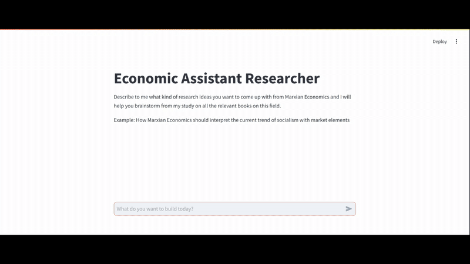

# ECONOMIC RESEARCH ASSISTANT

An Agentic RAG assistant designed for deep engagement with Marxian economics. Powered by DeepSeek, Groq, and local LLMs via Ollama, it retrieves and processes highly technical texts with precision. Using Supabase for vector storage, advanced chunking, and structured prompting, it ensures accurate and context-aware responses. Built with a multi-agent pipeline, it not only answers but also critiques and refines its reasoning dynamically.





## Features

- Agentic workflow orchestrated by Langraph
- Specialized agents for reasoning and dictate the workflow
- Marxian/classical economics crawling and chunking
- Vector database storage with Supabase
- Semantic search using OpenAI embeddings
- RAG-based question answering
- Support for code block preservation
- Streamlit UI for interactive querying

## Prerequisites

- Python 3.11+
- Supabase account and database
- Groq API Key for Cloud based LLMs or  Ollama for local LLMs
- Streamlit (for web interface)

## Installation

1. Clone the repository:
```bash
git clone [https://github.com/tuananhfrtk/Economic-research-assistant.git]
```

2. Install dependencies (recommended to use a Python virtual environment):
```bash
python -m venv venv
source venv/bin/activate  # On Windows: venv\Scripts\activate
pip install -r requirements.txt
```

3. Set up environment variables:
   - Rename `.env.example` to `.env`
   - Edit `.env` with your API keys and preferences:
   ```env
   BASE_URL=https://api.openai.com/v1 for OpenAI, https://api.openrouter.ai/v1 for OpenRouter, or your Ollama URL
   LLM_API_KEY=your_openai_or_openrouter_api_key
   OPENAI_API_KEY=your_openai_api_key
   SUPABASE_URL=your_supabase_url
   SUPABASE_SERVICE_KEY=your_supabase_service_key
   PRIMARY_MODEL=gpt-4o-mini  # or your preferred OpenAI model for main agent
   REASONER_MODEL=o3-mini     # or your preferred OpenAI model for reasoning
   ```

## Usage

### Database Setup

Execute the SQL commands in `site_pages.sql` to:
1. Create the necessary tables
2. Enable vector similarity search
3. Set up Row Level Security policies

In Supabase, do this by going to the "SQL Editor" tab and pasting in the SQL into the editor there. Then click "Run".

### Crawl Documentation

To crawl and store documentation in the vector database:

```bash
python crawl_econ.py
```

This will:
1. Fetch URLs from the documentation sitemap
2. Crawl each page and split into chunks
3. Generate embeddings and store in Supabase

### Chunking Configuration

You can configure chunking parameters in `crawl_pydantic_ai_docs.py`:
```python
chunk_size = 5000  # Characters per chunk
```

The chunker intelligently preserves:
- Code blocks
- Paragraph boundaries
- Sentence boundaries

### Streamlit Web Interface

For an interactive web interface to query the documentation and create agents:

```bash
streamlit run streamlit_ui.py
```

The interface will be available at `http://localhost:8501`

## Configuration

### Database Schema

The Supabase database uses the following schema:
```sql
CREATE TABLE site_pages (
    id UUID PRIMARY KEY DEFAULT uuid_generate_v4(),
    url TEXT,
    chunk_number INTEGER,
    title TEXT,
    summary TEXT,
    content TEXT,
    metadata JSONB,
    embedding VECTOR(1536)
);
```

## Project Structure

- `econ_research_graph.py`: LangGraph workflow definition and agent coordination
- `econ_researcher.py`: Main coding agent with RAG capabilities
- `crawl_econ.py`: Documentation crawler and processor
- `streamlit_ui.py`: Web interface with streaming support
- `site_pages.sql`: Database setup commands
- `requirements.txt`: Project dependencies


